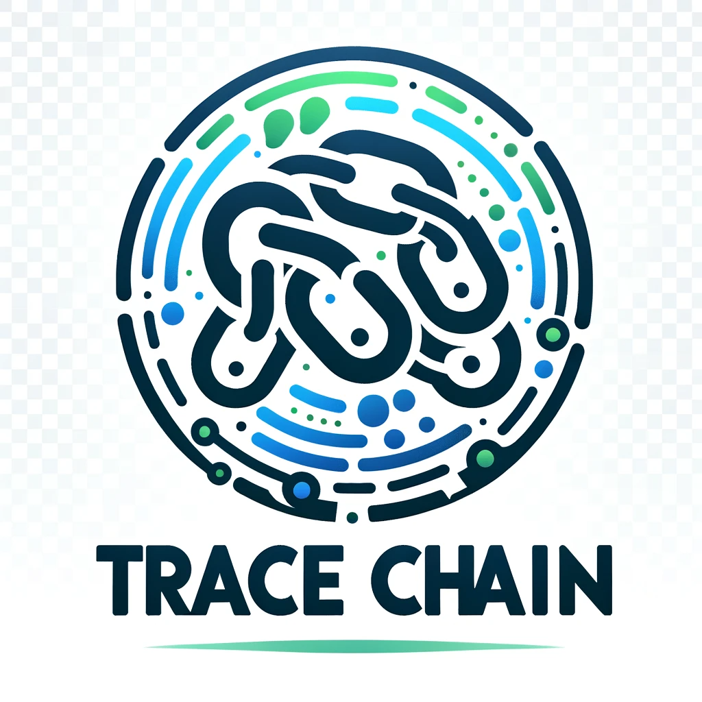

#  <div style='vertical-align:middle; display:inline;'>Tracechain</div>

Production deployment: https://tracechain.vercel.app/

Tracechain is a decentralized platform designed to enhance supply chain transparency. It enables manufacturers, suppliers, and consumers to access and verify product information securely. This project aims to revolutionize Solidity compilation with a user-centric approach, providing a feature-rich suite that emphasizes accessibility, security, and performance.

## Features

- **Decentralized Supply Chain Transparency**: `Tracechain` facilitates a transparent and decentralized supply chain, ensuring the authenticity and integrity of product information.

- **Compatibility with Multiple Blockchain Networks**: The platform interfaces with various blockchain networks, including `Mantle`, `Celo`, `Zeta`, `Scroll Sepolia`, `Arbitrum`, `Base`, `Polygon zkEVM` and `OKX Testnet`.

- **Lighthouse Storage using IPFS**: Secure and decentralized storage of product-related data is achieved through programmable storage using the [Lighthouse Storage SDK](https://www.lighthouse.storage/) with the [InterPlanetary File System (IPFS)](https://ipfs.tech/). This ensures an immutable and transparent supply chain history. The data is stored in an encrypted manner, involving the use of an encryption key by the data publisher.

- **Participant collectibles**: Supply chain participants can also interact in the [monaverse](https://monaverse.com/) & share collectibles.

## Deployment

Here is a table showcasing the deployments of `Tracechain` on various blockchain networks:

| Blockchain Network                                                | Contract Address                  | Explorer Link                               |
|-------------------------------------------------------------------| --------------------------------- | --------------------------------------------| 
| [Mantle](https://www.mantle.xyz/)                                 | `0xeBB9868674Daa23A54e5235e950D78a733a00393` | [Mantle Explorer](https://explorer.testnet.mantle.xyz/address/0xeBB9868674Daa23A54e5235e950D78a733a00393)        |
| [Celo Alfajores](https://docs.celo.org/network/alfajores)         | `0xb9652c6565C66C80b5C3385f0243f07805bdB38E` | [Celo Explorer](https://explorer.bitquery.io/celo_alfajores/smart_contract/0xb9652c6565C66C80b5C3385f0243f07805bdB38E)          |
| [Zeta](https://www.zetachain.com/)                                | `0xeBB9868674Daa23A54e5235e950D78a733a00393` | [Zeta Explorer](https://explorer.zetachain.com/address/0xeBB9868674Daa23A54e5235e950D78a733a00393)          |
| [Scroll Sepolia](https://scroll.io/)                              | `0x6b77c6DDE0b1b04b8859071D42621C7690a062E9` | [Scroll Sepolia Explorer](https://sepolia.scrollscan.dev/address/0x6b77c6DDE0b1b04b8859071D42621C7690a062E9)|
| [Arbitrum Sepolia](https://arbitrum.io/)                          | `0xeBB9868674Daa23A54e5235e950D78a733a00393` | [Arbitrum Explorer](https://sepolia.arbiscan.io/address/0xeBB9868674Daa23A54e5235e950D78a733a00393)      |
| [Base Goerli](https://base.org/)                                         | `0xeBB9868674Daa23A54e5235e950D78a733a00393` | [Base Explorer](https://goerli.basescan.org/address/0xeBB9868674Daa23A54e5235e950D78a733a00393)          |
| [Polygon zkEVM Testnet](https://polygon.technology/polygon-zkevm) | `0x1d0bDCa77D8341De8D4da4926274cb42B21a1586` | [Polygon zkEVM Testnet Explorer](https://testnet-zkevm.polygonscan.com/address/0x1d0bDCa77D8341De8D4da4926274cb42B21a1586)|
| [OKX X1 Testnet](https://www.okx.com/x1)                          | `0xeBB9868674Daa23A54e5235e950D78a733a00393` | [OKX X1 Testnet](https://www.oklink.com/x1-test/address/0xeBB9868674Daa23A54e5235e950D78a733a00393)|


## Getting Started

To get started with Tracechain, follow the steps below:

1. Clone the repository:

   ```bash
   git clone https://github.com/twin-devs/tracechain.git
   ```

2. Install dependencies:

   ```bash
   cd tracechain/traceui
   npm install
   ```

3. Run the nextjs app
   ```bash
   npm run dev
   ```

## Project structure

* `contracts`: The smart contracts live inside this folder
* `traceui`: This contains the nextJS UI application

## Contributors

1. [Abhishek Kumar](https://github.com/xenowits)
2. [Dhruv Bodani](https://github.com/dB2510)
3. [Nishtha Bodani](https://github.com/nb9960)
